# Exercices for Les Descodeuses

## Exercice I 

A/ Install docker system on your local machine

B/ Create a directory on your local machine as follows : (FirstName)_(LastName)_(NameOfYourFavoriteFruit)_codeuses

C/ Into the folder created above, create a Dockerfile which contains all required instructions to start a jenkins server on your local machine
- Tips : Your Dockerfile looks like this : 

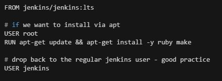

C/ Start building your Dockerfile
- Tips : Use the docker build.... command

D/ Run your jenkins docker container
- Tips : Use the docker run.... command

Caution : take into account that your jenkins is listening on port 8080 inside the container.

Also the port 50000 can be added while running your container if you intend to attach a jenkins node agent

E/ Ensure that your jenkins docker container is up and running on local
- Tips : Use the docker ps.... command

F/ Open your browser and check that your jenkins server is up and running and it's reachable at :
- http://(your-ip-address):8080

or

- http://localhost:8080

G/ Once jenkins starts for the first time, it requires an administrator password ... At this stage, find a way to retrieve this password inside the container
- Tips : Use docker exec -ti.... command to log into the container

## Exercise II

A/ Submit the folder containing your dockerfile to GitHub repository : https://github.com/rovland/descodeuses.git
- Tips : Use GitHub Desktop application for windows or directly use git command line such as git clone, git commit -m, git push

## Exercise III

A/ Once connected to jenkins, start installing docker plugin by browsing this url : http://(localhost OR IP-Address):8080/pluginManager/available?filter=Cloud+Providers

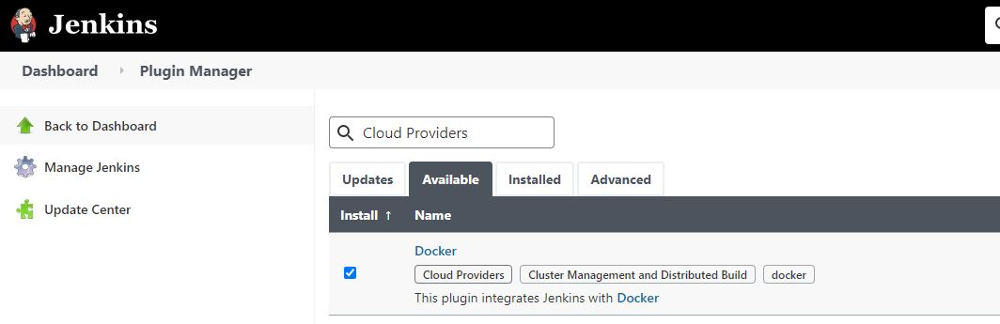

Check 'Docker' plugin as shown above and click on 'install without restart' button

B/ Create your first jenkins pipeline job by clicking on "Create a job"

- Enter a jenkins job name : myFirstPipeline

- Select 'pipeline'

- Validate by clicking on OK button

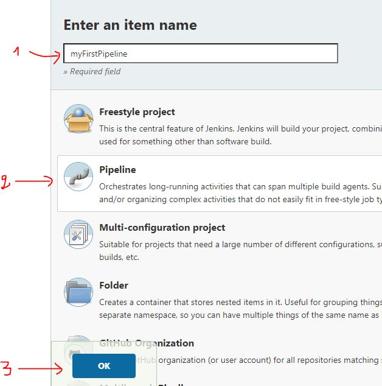

C/ In your jenkins job configuration, write the "Hello World" code inside the pipeline script console as follows :

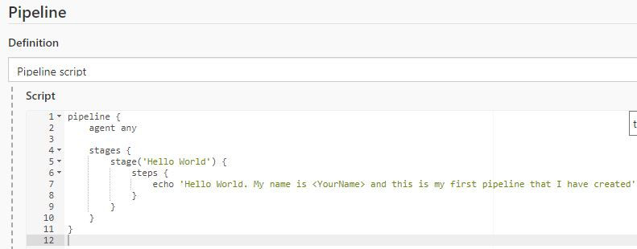

Save your configuration by clicking on 'save' button

Start building your project by clicking on "Build Now" button

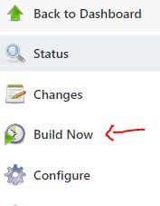

Check-out the console output of the job

## Exercise IV

A/ Create a jenkinsfile into the folder created at Exercise I

B/ Start editing the file with your desired editor (Visual Studio Code for example)

C/ write the code below in your jenkinsfile

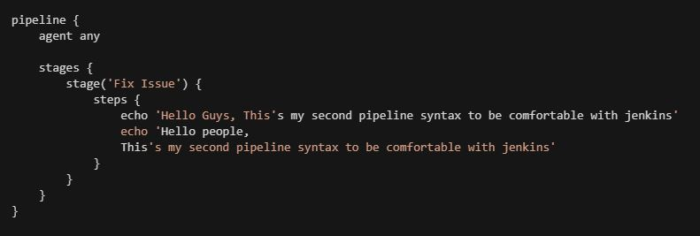

Submit the jenkinsfile to GitHub repository : https://github.com/rovland/descodeuses.git

D/ Create a new jenkins pipeline job

E/ Within your job configuration, Change the pipeline definition to use a jenkinsfile as follows :

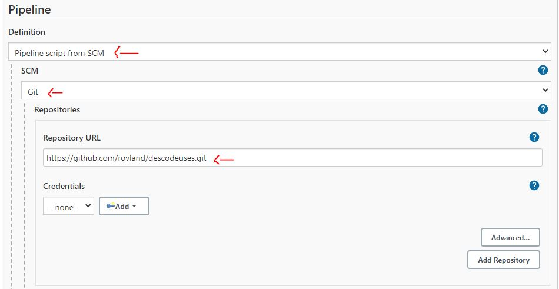

Scroll down at the bottom and change the value of 'Script Path' field in order to locate your jenkinsfile submitted to GitHub repository

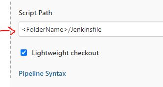

Save your changes and build the job

F/ Find a way to fix all errors occur by editing your jenkinsfile on local
- Tips : Using the 'replay' option on a jenkins build job, it's straightforward to quickly test your modifications

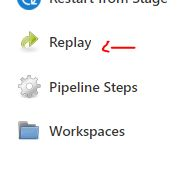

Submit your modified jenkinsfile to github repository and re-test it on jenkins

## Exercise V

A/ Configure your jenkins server to found the maven M3 tool as follows :
- Go to : Manage Jenkins → Global Tool Configuration

- Scroll down, search Maven option and click on 'Add Maven' button

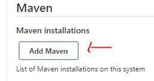

- Configure your Maven installation as follows : 

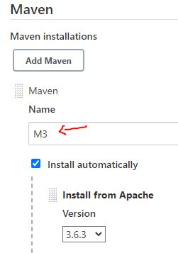

B/ Create a new jenkinsfile called : jenkinsfile_maven and save it inside the folder created at Exercise I

C/ Write the code below on your jenkinsfile_maven

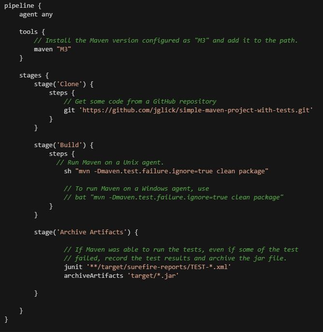

D/ Submit the code to github repo

E/ Create a new jenkins pipeline job using your jenkins_maven file

F/ Save your changes and build the jenkins job

G/ Some expected errors occur ... Please fix them by editing your jenkinsfile_maven

H/ Submit your modified jenkinsfile_maven to Github repo

I/ Modify your jenkinsfile_maven by adding the code below : 

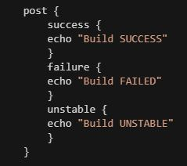

Submit your modified jenkinsfile_maven to GitHub repo

Build the jenkins job accordingly and check each pipeline stages

